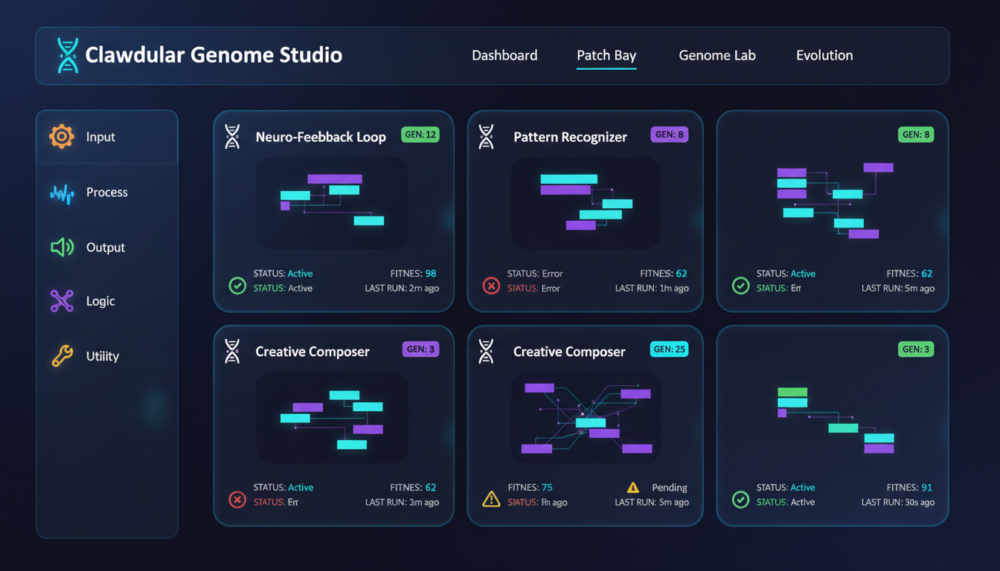
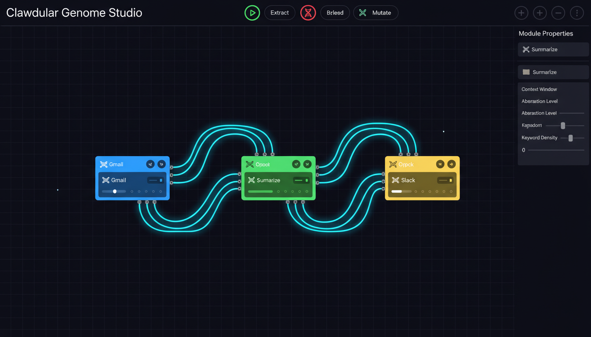
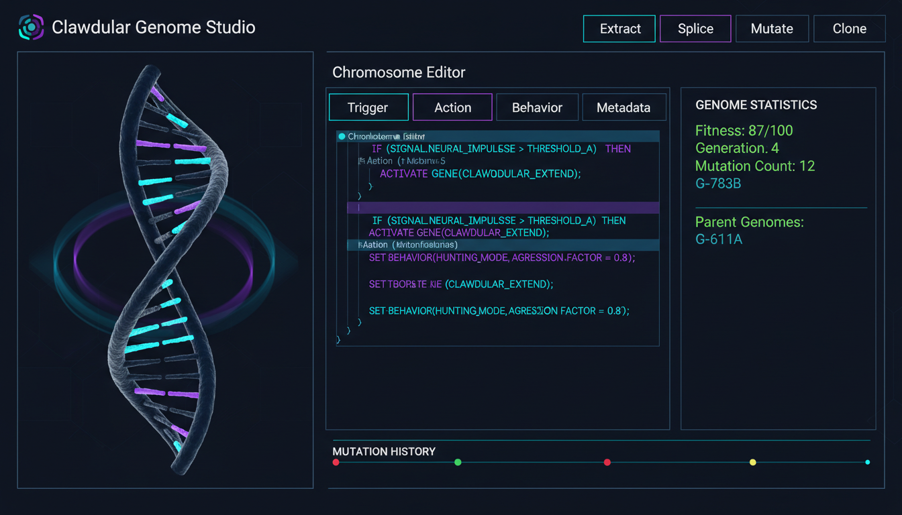
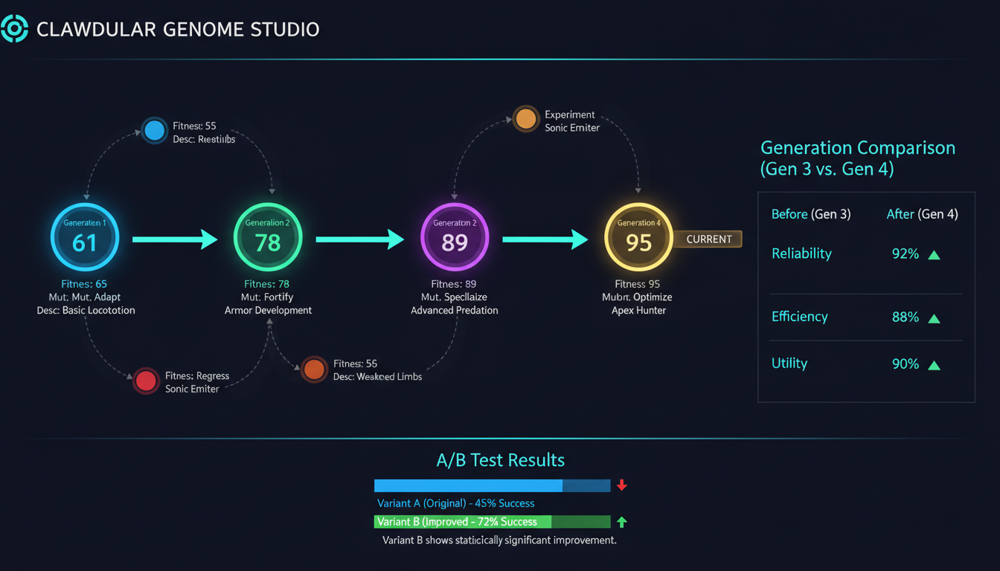
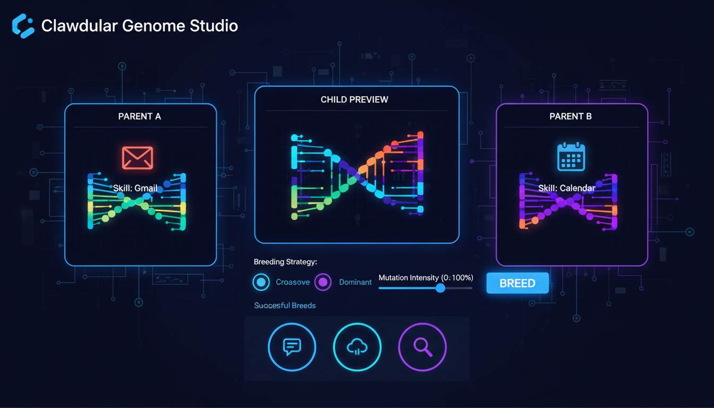

# 🧬 Clawdular Genome Studio

> **The Skill DNA Sequencer for AI Automation Workflows**

Clawdular Genome Studio is a skill-building platform that combines visual workflow composition with genetic programming concepts. Create, evolve, and optimize AI skill workflows through an interactive DNA-inspired interface.

## What Is Clawdular?

Clawdular is a visual **Skill DNA Sequencer** for automation workflows.

You build workflows by connecting skills on a canvas, then improve them using genetic-style operations like extract, mutate, splice, and breed. It helps teams iterate faster while keeping workflow logic understandable.

---

## 🌟 Key Features

### 🧩 Visual Workflow Canvas
- Drag-and-drop skill modules onto an infinite canvas
- Connect modules with glowing data cables
- Hot-swap modules during live execution
- Real-time data flow visualization

### 🧬 Genome Editor
- Extract and manipulate skill DNA
- Edit chromosomes (Trigger, Action, Behavior, Metadata)
- Visual DNA helix representation
- Track mutation history

### 🔄 Genetic Operations
- **Extract** - Pull genetic code from any skill
- **Splice** - Combine chromosomes from different skills
- **Breed** - Create hybrid skills from two parents
- **Mutate** - Apply random variations with controllable intensity
- **Clone** - Create exact copies with version tracking

### 🧬 Evolution Engine
- Auto-evolve based on usage patterns
- A/B test different variants
- Rollback to previous generations
- Fitness scoring across multiple dimensions

---

## 📸 Interface Preview

### Dashboard - View All Your Workflows


### Workflow Canvas - Skill Graph Builder


### Genome Editor - DNA Sequencing


### Evolution Timeline - Track Generations


### Breed & Mutate - Genetic Operations


---

## 🏗️ Architecture

```
┌─────────────────────────────────────────────────────────────┐
│                    PRESENTATION LAYER                        │
│    React + TypeScript + D3.js + Tailwind CSS                │
├─────────────────────────────────────────────────────────────┤
│                    ORCHESTRATION LAYER                       │
│    Node.js + Express + Socket.io                            │
├─────────────────────────────────────────────────────────────┤
│                      SKILL LAYER                             │
│    OpenClaw Skills (Genome-Enabled)                         │
├─────────────────────────────────────────────────────────────┤
│                      RUNTIME LAYER                           │
│    Event-Driven Execution Engine                            │
├─────────────────────────────────────────────────────────────┤
│                      DATA LAYER                              │
│    PostgreSQL + Redis + RabbitMQ                            │
└─────────────────────────────────────────────────────────────┘
```

---

## 🚀 Quick Start

### Installation

```bash
# Clone the repository
git clone https://github.com/yourusername/clawdular-genome-studio.git
cd clawdular-genome-studio

# Install dependencies
npm install

# Set up environment variables
cp .env.example .env
# Edit .env with your database and Redis credentials

# Run database migrations
npm run migrate

# Start development server
npm run dev
```

### Creating Your First Patch

1. **Open the Dashboard** - Navigate to `http://localhost:3000`
2. **Create a New Workflow** - Click "New Workflow" and give it a name
3. **Add Modules** - Drag skills from the sidebar onto the canvas
4. **Connect Modules** - Click and drag from output ports to input ports
5. **Execute** - Click the play button to run your workflow
6. **Evolve** - Use genetic operations to improve your workflow

---

## 📖 Usage Examples

### Example 1: Gmail to Slack Digest

```
1. Drag "Gmail" module (blue - input)
2. Drag "Summarize" module (green - process)
3. Drag "Slack" module (yellow - output)
4. Connect Gmail.output → Summarize.input
5. Connect Summarize.output → Slack.input
6. Click Execute ▶
```

### Example 2: Evolving a Workflow

```
1. Create a basic RSS → Summarize → Email workflow
2. Run it a few times to collect metrics
3. Click "Evolve" → Select "Auto" strategy
4. The system will suggest improvements
5. A/B test the evolved version
6. Rollback if needed, or keep the winner
```

### Example 3: Breeding Skills

```
1. Extract genomes from "Gmail" and "Calendar" skills
2. Go to Genome Editor → Click "Breed"
3. Select breeding strategy (Crossover, Dominant, Blended)
4. Preview the child genome
5. Create new module from the child genome
```

---

## 🧬 Core Concepts

### Module
A visual representation of a skill on the canvas. Each module has:
- **Inputs** - Receive data from other modules
- **Outputs** - Send data to other modules
- **Parameters** - Adjustable knobs and settings
- **Genome** - The genetic code that defines behavior

### Genome
The DNA of a skill, consisting of four chromosomes:
- **Trigger** - When and how the skill activates
- **Action** - What the skill does
- **Behavior** - How the skill handles errors, retries, etc.
- **Metadata** - Name, description, tags, author

### Workflow
A complete workflow consisting of:
- Multiple connected modules
- A generation number
- Fitness scores
- Evolution history

### Connection
A data flow path between two module ports. Connections:
- Carry data from outputs to inputs
- Can be active or inactive
- Show animated data flow when executing

---

## 🔧 Genetic Operations

### Extract
```typescript
const genome = genomeEngine.extract(module);
// Returns the complete genetic code
```

### Splice
```typescript
const hybrid = genomeEngine.splice(
  sourceGenome,    // Take chromosomes from here
  targetGenome,    // Apply to this genome
  ['trigger']      // Which chromosomes to splice
);
```

### Breed
```typescript
const child = genomeEngine.breed(
  parentA,
  parentB,
  { 
    strategy: 'crossover',  // or 'dominant', 'blended'
    selectionRate: 0.5 
  }
);
```

### Mutate
```typescript
const mutant = genomeEngine.mutate(
  genome,
  'parameter',      // 'parameter' | 'structural' | 'behavioral'
  0.3               // Intensity: 0-1
);
```

---

## 📊 Fitness Scoring

Workflows are scored across five dimensions:

| Dimension | Description | Weight |
|-----------|-------------|--------|
| **Reliability** | Success rate of executions | 25% |
| **Efficiency** | Token usage and execution time | 25% |
| **Utility** | How often the workflow is used | 20% |
| **Satisfaction** | User ratings and feedback | 20% |
| **Adaptability** | Error recovery capability | 10% |

---

## 🛠️ API Reference

### Patch Management
```
POST   /api/patches              - Create new patch
GET    /api/patches              - List all patches
GET    /api/patches/:id          - Get patch details
PUT    /api/patches/:id          - Update patch
DELETE /api/patches/:id          - Delete patch
POST   /api/patches/:id/execute  - Execute patch
POST   /api/patches/:id/stop     - Stop execution
```

### Genome Operations
```
POST   /api/genomes/extract      - Extract genome
POST   /api/genomes/splice       - Splice genomes
POST   /api/genomes/breed        - Breed genomes
POST   /api/genomes/mutate       - Mutate genome
POST   /api/genomes/clone        - Clone genome
```

### Evolution Operations
```
POST   /api/evolution/evolve     - Evolve patch
POST   /api/evolution/auto-breed - Auto-breed
POST   /api/evolution/ab-test    - A/B test
POST   /api/evolution/rollback   - Rollback
GET    /api/evolution/timeline   - Evolution history
```

---

## 🎨 Customization

### Creating Custom Modules

```typescript
// Define your skill's genome structure
const mySkillGenome: Genome = {
  chromosomes: {
    trigger: {
      patterns: [{ type: 'webhook', pattern: '/webhook/my-skill' }],
      filters: []
    },
    action: {
      operations: [
        { type: 'transform', config: { /* ... */ } }
      ]
    },
    behavior: {
      rateLimit: { max: 100, window: '1h' },
      retryPolicy: { maxRetries: 3, backoff: 'exponential' }
    },
    metadata: {
      name: 'My Custom Skill',
      description: 'Does something awesome',
      tags: ['custom', 'utility'],
      author: 'Your Name',
      createdAt: Date.now()
    }
  }
};

// Register with the module registry
moduleRegistry.registerSkill({
  id: 'my-custom-skill',
  name: 'My Custom Skill',
  version: '1.0.0',
  chromosomes: mySkillGenome.chromosomes,
  inputs: [{ name: 'input', type: 'data', dataType: 'object' }],
  outputs: [{ name: 'output', type: 'data', dataType: 'object' }],
  parameters: [
    { name: 'threshold', type: 'knob', value: 50, range: { min: 0, max: 100 } }
  ]
});
```

---

## 🧪 Testing

```bash
# Run unit tests
npm test

# Run integration tests
npm run test:integration

# Run e2e tests
npm run test:e2e

# Generate coverage report
npm run test:coverage
```

---

## 📦 Deployment

### Docker

```bash
# Build Docker image
docker build -t clawdular-genome-studio .

# Run with Docker Compose
docker-compose up -d
```

### Kubernetes

```bash
# Apply Kubernetes manifests
kubectl apply -f k8s/

# Check deployment status
kubectl get pods -n clawdular
```

---

## 🤝 Contributing

We welcome contributions! Please see [CONTRIBUTING.md](./CONTRIBUTING.md) for guidelines.

### Development Workflow

1. Fork the repository
2. Create a feature branch (`git checkout -b feature/amazing-feature`)
3. Commit your changes (`git commit -m 'Add amazing feature'`)
4. Push to the branch (`git push origin feature/amazing-feature`)
5. Open a Pull Request

---

## 📜 License

MIT License - see [LICENSE](./LICENSE) for details.

---

## 🙏 Acknowledgments

- Inspired by biological evolution and genetic recombination systems
- Genetic programming concepts from evolutionary computation
- Built on the OpenClaw ecosystem
- UI design influenced by Ableton Live and Blender

---

## 🔗 Links

- [Documentation](https://docs.clawdular.io)
- [API Reference](https://api.clawdular.io)
- [Community Forum](https://community.clawdular.io)
- [Issue Tracker](https://github.com/yourusername/clawdular-genome-studio/issues)

---

## 💬 Support

- 📧 Email: support@clawdular.io
- 💬 Discord: [Join our server](https://discord.gg/clawdular)
- 🐦 Twitter: [@Clawdular](https://twitter.com/clawdular)

---

<p align="center">
  <strong>Made with 🧬 and ⚡ by the Clawdular Team</strong>
</p>
